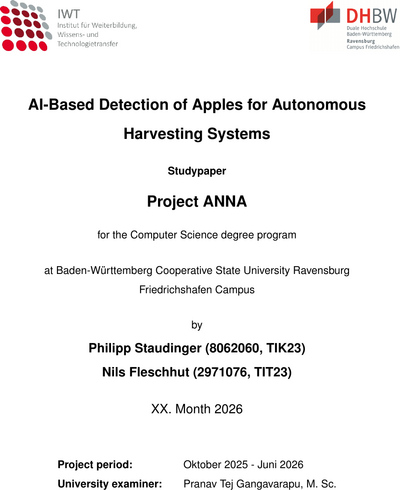

# Apple Vision

Apple detection and 3D localisation pipeline. Trains two independent models from separate datasets:

- **Apple detector** — Faster R-CNN (torchvision) fine-tuned on COCO-style annotations (MinneApple, Orchard Benchmark, Apple MOTS)
- **Depth estimator** — ResNet50 + U-Net decoder trained on paired RGB+depth images to predict metric depth from a single RGB image

At inference both models run on the same RGB image. Detected bounding boxes are back-projected into 3D using the predicted depth map and camera intrinsics, producing `(X, Y, Z, radius)` in metres for each apple.

## Paper

**AI-Based Detection of Apples for Autonomous Harvesting Systems**  
Philipp Staudinger, Nils Fleschhut — DHBW Ravensburg, 2026

[](paper/studienarbeit.pdf)

## Requirements

- Python >= 3.10
- PyTorch >= 2.2, torchvision >= 0.17, pycocotools, pillow, numpy, tqdm
- Optional: CUDA-capable GPU (CPU training works but is much slower)

## Installation

**With uv (recommended):**
```bash
uv sync
```

**With pip:**
```bash
python -m venv .venv
source .venv/bin/activate  # Windows: .venv\Scripts\activate
pip install -e .
```

## Datasets

### MinneApple

Raw data layout after download:
```
data/minneapple/detection/
  train/images/   train/masks/
  test/images/    test/masks/
```

Convert to COCO format:
```bash
uv run python scripts/prepare_minneapple.py --root data/minneapple/detection --val-ratio 0.15 --seed 42
```

Output: `data/minneapple/coco/`

---

### Apple Dataset Benchmark from Orchard Environment

Download from [Dataset Ninja](https://datasetninja.com/apple-dataset-benchmark-from-orchard-environment). After extracting, the raw folder should contain subfolders `ArtificialLight/`, `CropLoadEstimation/`, `HarvestingRobot2016/`, `HarvestingRobot2017/`.

Convert to COCO format:
```bash
uv run python scripts/prepare_orchard_benchmark.py --root data/orchard/raw --val-ratio 0.15 --seed 42
```

Options: `--test-ratio <float>` to create a test split, `--symlink` to symlink instead of copying images.

Output: `data/orchard/coco/`

---

### Apple MOTS

Download from [Dataset Ninja](https://datasetninja.com/apple-mots). After extracting, the raw folder should contain:
```
data/apple_mots/raw/
  train/images/<sequence>/*.png
  train/instances/<sequence>/*.png
  testing/images/<sequence>/*.png
  testing/instances/<sequence>/*.png
```

Convert instance masks to COCO bounding boxes:
```bash
# Use official testing set as validation
uv run python scripts/prepare_apple_mots.py \
  --root data/apple_mots/raw \
  --train-splits train \
  --val-splits testing \
  --seed 42

# Or: random val split from train, testing as a dedicated test set
uv run python scripts/prepare_apple_mots.py \
  --root data/apple_mots/raw \
  --train-splits train \
  --val-splits "" \
  --val-ratio 0.1 \
  --test-splits testing
```

Output: `data/apple_mots/coco/`

---

### Synthetic apples (Supervisely polygons)

Rendered orchard scenes with polygon labels exported from Supervisely (native
`img/` + `ann/*.json` format). Convert the polygons to COCO bounding boxes:

```bash
uv run python scripts/prepare_synthetic.py --root data/synthetic/raw --seed 42
```

Only class `apple` is kept; boxes are clamped to the image bounds; images with no
objects are kept as negatives. Everything goes to the `train` split by default —
synthetic data is training-only and must never enter the shared evaluation set.

Output: `data/synthetic/coco/`

---

### Shared evaluation set (benchmark)

A single frozen set used to compare **all** trained models on equal footing. It is
carved from the annotated pool of the real datasets only (MinneApple, Apple MOTS,
Orchard) — real, un-augmented, with ground truth — balanced by images (equal count
per dataset), and drawn deterministically per dataset:

```bash
uv run python scripts/build_benchmark_set.py \
  data/minneapple/coco data/apple_mots/coco data/orchard/coco \
  --per-dataset 50 --seed 42
```

Writes `data/benchmark/coco/` (split `test`) and `data/benchmark/benchmark_manifest.json`
with a SHA-256 per image. The manifest is the source of truth for the training
leakage guard below. **Build it once and never rebuild it between experiments** —
otherwise the comparison axis changes.

---

### Building a training set (configurable, leakage-free)

Compose a training set from any sources with a per-source image count
(`ROOT:N` or `ROOT:all`). Every benchmark image is excluded via the manifest and
a hard assertion, so no evaluation image can leak into training:

```bash
uv run python scripts/build_training_set.py \
  --source data/minneapple/coco:400 \
  --source data/apple_mots/coco:all \
  --source data/orchard/coco:800 \
  --source data/synthetic/coco:500 \
  --benchmark-manifest data/benchmark/benchmark_manifest.json \
  --output data/train_v1/coco --val-ratio 0.1 --val-exclude synthetic --seed 42
```

Selection is nested (shuffle then prefix): a larger count is a superset of a
smaller one, so increasing a source isolates the effect of *adding* data.
`--val-exclude synthetic` keeps the internal val split real-only for a clean
early-stopping signal. `--verify-hashes` adds a SHA-256 cross-check. Each run
writes a `training_manifest.json` for full reproducibility.

Output: `data/train_v1/coco/`

**Synthetic-ratio ablation:** hold the real base fixed and sweep the synthetic
count to plot accuracy vs. synthetic proportion:

```bash
REAL="--source data/minneapple/coco:all --source data/apple_mots/coco:all --source data/orchard/coco:all"
for N in 0 100 200 400 800 1129; do
  uv run python scripts/build_training_set.py $REAL \
    --source data/synthetic/coco:$N \
    --benchmark-manifest data/benchmark/benchmark_manifest.json \
    --output data/sweep_synth_$N/coco \
    --val-ratio 0.1 --val-exclude synthetic --seed 42
done
```

Keep the augmentation config constant across the sweep, and evaluate every model
on the same `data/benchmark/coco`.

---

### Packaging for Kaggle

Train on Kaggle by uploading the data **once** and composing each training set
inside the notebook. Assemble the upload folder (hardlinks, no extra disk) and
`dataset-metadata.json`:

```bash
uv run python scripts/package_for_kaggle.py \
  --source data/minneapple/coco --source data/apple_mots/coco \
  --source data/orchard/coco --source data/synthetic/coco \
  --benchmark data/benchmark/coco \
  --manifest data/benchmark/benchmark_manifest.json \
  --dataset-id <username>/apple-vision-data \
  --output data/kaggle_upload
```

```bash
kaggle datasets create  -p data/kaggle_upload --dir-mode zip   # first upload
kaggle datasets version -p data/kaggle_upload -m "update"       # later updates
```

In the notebook (`notebooks/apple-detection-training.ipynb`), each sweep point
just sets `SYNTHETIC_N`; `build_training_set.py` composes the set from
`/kaggle/input` into `/kaggle/working` (symlinks, which resolve within the
session), then training and benchmark evaluation run. No re-upload per sweep point.

---

### Merging Datasets

Combine multiple COCO-format datasets into one. Image and annotation IDs are remapped to be globally unique; images are symlinked (or copied) into the output directory, prefixed with the source dataset name to avoid filename collisions.

```bash
uv run python scripts/merge_coco_datasets.py \
  data/minneapple/coco data/orchard/coco \
  --output data/merged/coco
```

Options: `--splits train val test` to control which splits are merged (default: all three), `--copy` to copy images instead of symlinking.

Output: `data/merged/coco/`

---

### Dataset Cleaning

If a dataset contains corrupted images, run the cleaning script to move them out and remove their entries from the annotation JSON:
```bash
uv run python scripts/clean_coco_dataset.py data/orchard/coco
```

The script scans `images/train`, `images/val`, and `images/test`, moves corrupted files to a `broken/` subfolder, and updates the corresponding annotation JSONs in-place (a `.bak` backup is created first).

## Training

### Apple Detector

```bash
uv run python -m apple_vision.train --dataset-root data/minneapple/coco
```

| Flag | Default | Description |
|---|---|---|
| `--dataset-root` | *(required)* | Path to COCO-format dataset root |
| `--train-ann` | `annotations/instances_train.json` | Training annotation file |
| `--train-images` | `images/train` | Training images directory |
| `--val-ann` | `annotations/instances_val.json` | Validation annotation file |
| `--val-images` | `images/val` | Validation images directory |
| `--epochs` | `1` | Number of training epochs |
| `--batch-size` | `2` | Batch size |
| `--lr` | `0.005` | SGD learning rate |
| `--num-workers` | `2` | DataLoader workers |
| `--out-dir` | `checkpoints` | Directory for saved checkpoints |
| `--resume` | — | Path to a checkpoint to resume from |
| `--early-stop-patience` | `0` | Early stopping patience (0 = disabled) |
| `--no-aug` | — | Disable training augmentation entirely |
| `--aug-factor` | `1` | Augmented views per image per epoch (online oversampling, e.g. `4`) |
| `--aug-brightness` | `0.3` | ColorJitter brightness |
| `--aug-contrast` | `0.3` | ColorJitter contrast |
| `--aug-saturation` | `0.2` | ColorJitter saturation |
| `--aug-hue` | `0.05` | ColorJitter hue |
| `--aug-hflip` | `0.5` | Horizontal flip probability |
| `--aug-scale` | `0.0` | Scale jitter ± fraction (0 = off) |
| `--aug-translate` | `0.0` | Translation fraction (0 = off) |
| `--aug-rotate` | `0.0` | Rotation degrees ± (0 = off) |

Augmentation is applied to the **train split only** (torchvision transforms v2,
box-aware); validation and the shared benchmark stay un-augmented. For a clean
synthetic-ratio ablation, keep these flags identical across all sweep runs.

Checkpoints and training artifacts saved to `checkpoints/` (or `--out-dir`):
- `fasterrcnn_resnet50_fpn_apple_best.pth` — best val-loss checkpoint
- `fasterrcnn_resnet50_fpn_apple.pth` — final checkpoint
- `detector_metrics.csv` — per-epoch train/val loss
- `detector_loss.png` — loss curve plot

---

### Depth Estimator

Trains on paired RGB + depth images (uint16 PNG, millimetres). Expected dataset layout:

```
data/rgb_depth_o3de/
  rgb/    rgb_<timestamp>.png
  depth/  depth_<timestamp>.png
  camera/ camera_<timestamp>.json
```

The camera JSON follows the ROS `camera_info` format and must contain a `K` field (3×3 intrinsics as a flat 9-element list).

```bash
uv run python -m apple_vision.train_depth --dataset-root data/rgb_depth_o3de
```

| Flag | Default | Description |
|---|---|---|
| `--dataset-root` | *(required)* | Path to the RGB+depth dataset root |
| `--val-fraction` | `0.1` | Fraction of data held out for validation |
| `--epochs` | `20` | Number of training epochs |
| `--batch-size` | `2` | Batch size |
| `--lr` | `1e-4` | AdamW learning rate |
| `--num-workers` | `2` | DataLoader workers |
| `--out-dir` | `checkpoints` | Directory for saved checkpoints |
| `--resume` | — | Path to a checkpoint to resume from |
| `--no-pretrained` | — | Train backbone from scratch (not recommended) |
| `--early-stop-patience` | `0` | Early stopping patience (0 = disabled) |
| `--resize W H` | — | Resize images to W×H before training (e.g. `--resize 640 400`) |
| `--max-depth` | `10.0` | Ignore pixels beyond this depth in metres in the loss (0 = disabled) |

The model uses a scale-invariant log loss (Eigen et al., 2014) which handles the wide depth range (< 1 m to > 60 m) robustly.

Multi-GPU training is automatic: if multiple CUDA GPUs are available, the model is wrapped in `DataParallel`. The learning rate follows a cosine annealing schedule.

Checkpoints and training artifacts saved to `checkpoints/` (or `--out-dir`):
- `depth_estimator_best.pth` — best val-loss checkpoint
- `depth_estimator.pth` — final checkpoint
- `depth_estimator_metrics.csv` — per-epoch train/val loss
- `depth_estimator_loss.png` — loss curve plot

## Evaluation

### Apple Detector — COCO mAP

Evaluate a saved checkpoint against the validation set and report AP@[.5:.95], AP50, AP75, etc.:

```bash
uv run python -m apple_vision.evaluate_coco \
  --dataset-root data/minneapple/coco \
  --checkpoint checkpoints/fasterrcnn_resnet50_fpn_apple_best.pth
```

Key options:

| Flag | Default | Description |
|---|---|---|
| `--val-ann` | `annotations/instances_val.json` | Validation annotation file |
| `--val-images` | `images/val` | Validation images directory |
| `--results-json` | `coco_results.json` | Where to save raw detections |
| `--score-threshold` | `0.0` | Minimum score to keep a detection |
| `--device` | auto | `cuda` or `cpu` |

---

### Depth Estimator — pixel-level accuracy

Reports MAE, median AE, RMSE, and mean relative error (all in cm) over the validation or training split:

```bash
uv run python -m apple_vision.evaluate_depth \
  --checkpoint checkpoints/depth_estimator_best.pth \
  --dataset-root data/rgb_depth_o3de
```

| Flag | Default | Description |
|---|---|---|
| `--checkpoint` | *(required)* | Path to depth estimator checkpoint |
| `--dataset-root` | *(required)* | Path to the RGB+depth dataset root |
| `--split` | `val` | `train` or `val` |
| `--resize W H` | — | Resize images before inference |
| `--max-depth` | `10.0` | Only evaluate pixels up to this depth (metres) |

## Visualization

### Annotation quickplot

Quickly verify annotations by drawing ground-truth bounding boxes on a sample of images:

```bash
uv run python -m apple_vision.quickplot \
  --dataset-root data/minneapple/coco \
  --ann annotations/instances_val.json \
  --images images/val \
  --n 8 \
  --out-dir quickplots
```

Add `--show` to open the images after saving.

---

### Depth comparison

Side-by-side RGB / ground-truth depth / predicted depth panels saved as PNGs:

```bash
uv run python -m apple_vision.visualize_depth \
  --checkpoint checkpoints/depth_estimator_best.pth \
  --dataset-root data/rgb_depth_o3de \
  --n 8 \
  --out-dir quickplots/depth
```

| Flag | Default | Description |
|---|---|---|
| `--checkpoint` | *(required)* | Path to depth estimator checkpoint |
| `--dataset-root` | *(required)* | Path to the RGB+depth dataset root |
| `--out-dir` | `quickplots/depth` | Where to save the panels |
| `--n` | `4` | Number of samples to visualize |
| `--split` | `val` | `train` or `val` |
| `--resize W H` | — | Resize images before inference |
| `--colormap` | `plasma` | Matplotlib colormap name |
| `--max-depth` | `10.0` | Pixels beyond this depth are shown in grey |

## Kaggle Notebooks

Ready-to-run notebooks for cloud GPU training are stored in `notebooks/`. Upload the repo as a Kaggle dataset or clone it inside the notebook — both notebooks handle setup automatically.

| Notebook | Description |
|---|---|
| [`notebooks/depth-estimation-training.ipynb`](notebooks/depth-estimation-training.ipynb) | Train the ResNet50 + U-Net depth estimator |
| [`notebooks/apple-detection-training.ipynb`](notebooks/apple-detection-training.ipynb) | Fine-tune Faster R-CNN on a COCO apple dataset |

Each notebook: clones the repo, installs dependencies via `uv sync`, checks the input dataset, runs training, evaluates, and saves visualizations to `/kaggle/working/`. Update the `DATASET_ROOT` variable in the dataset-check cell to match your Kaggle input path.

## Project Structure

```
apple_vision/
  train.py              # detector training loop
  train_depth.py        # depth estimator training loop
  evaluate_coco.py      # COCO mAP evaluation for the detector
  evaluate_depth.py     # pixel-level accuracy metrics for the depth estimator
  quickplot.py          # annotation visualizer (ground-truth bounding boxes)
  visualize_depth.py    # side-by-side depth comparison plots
  plot_metrics.py       # shared CSV + loss-curve utilities (used by training scripts)
  models/
    detector.py           # Faster R-CNN factory
    depth_estimator.py    # ResNet50 + U-Net decoder, SI-log loss
  data/
    minneapple.py         # COCO dataset class (box-aware v2 transform hook)
    transforms.py         # augmentation (torchvision v2): brightness/contrast/HSV/flip/geometry
    repeat.py             # RepeatDataset: N augmented views per image (--aug-factor)
    rgbd.py               # paired RGB+depth dataset class
scripts/
  prepare_minneapple.py          # MinneApple → COCO
  prepare_orchard_benchmark.py   # Orchard → COCO
  prepare_apple_mots.py          # Apple MOTS masks → COCO
  prepare_synthetic.py           # synthetic Supervisely polygons → COCO
  build_benchmark_set.py         # frozen shared evaluation set + manifest
  build_training_set.py          # configurable, leakage-free training set
  package_for_kaggle.py          # assemble Kaggle upload folder + metadata
  merge_coco_datasets.py         # merge multiple COCO datasets into one
  clean_coco_dataset.py          # remove corrupted images & fix annotations
notebooks/
  depth-estimation-training.ipynb  # Kaggle: depth estimator training
  apple-detection-training.ipynb   # Kaggle: apple detector training
```
